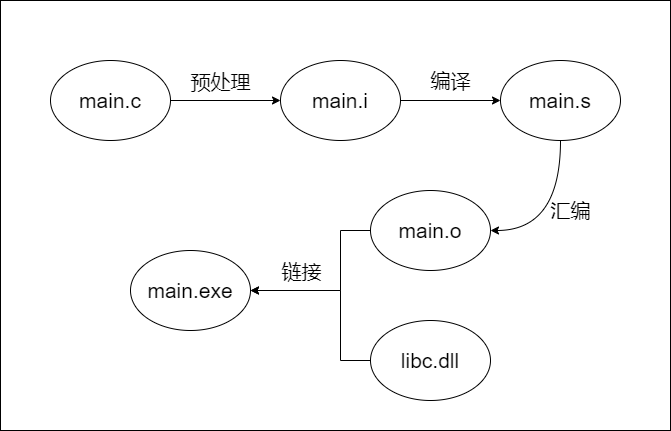
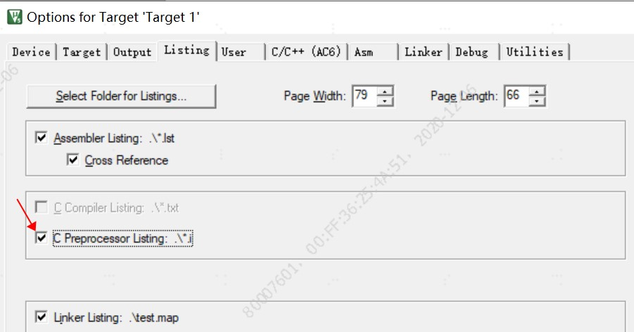
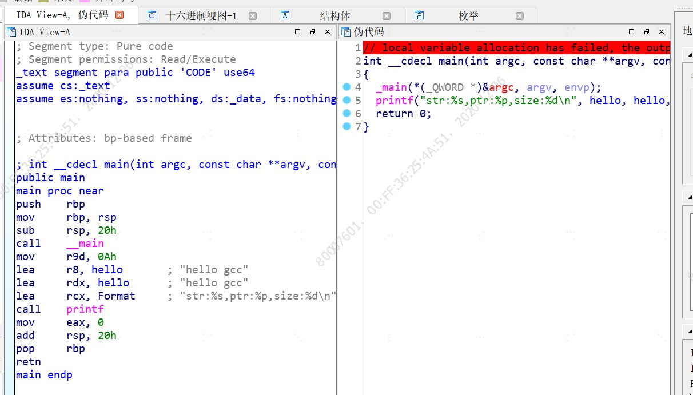

# 从编码到运行-程序的孕育过程

## 前言
程序从一堆字符怎么变成一个可运行的程序呢，在这我们使用最简单的一个hello word 程序来演示程序的一个完整流程。  
在这过程中找到一些有用的调试方法，帮助我们在debug时快速解决问题。

程序编译时的整体流程经过：
* **编码** 、 **预处理** 、**编译**、 **汇编**、 **链接** 




**运行环境**
> windows 10 + cygwin
>gcc 版本 7.4.0 

## 一、 编码
按照C语言语法规则，将字符组合成一段有特定含义的文本。  

main.c
```c
#include <stdio.h>

char hello[]={"hello word"};

int main(void)
{
    /*打印字符数组，显示字符串位置和大小*/
    printf("str:%s,ptr:%p,size:%d\n",hello,hello,sizeof(hello));

    return 0;
}
```

## 二、 预处理
预处理主要是将源文件中的预处理指令(```#define, #include ```)展开、替换或者对条件编译选项进行选择删除。  

关于预处理指令的详细说明在下一篇博客中详细说明。  

在gcc中与预处理有关常用的查看指令有：
* **-E** ：主要选项，gcc 使用该参数生成预编译文件；
* **-C** ：进行字符串替换时保留注释
* **-P** : 不输出#line 信息
* **-D**macro : 对参与编译的所有文件使用宏定义 macro
* **-include** file : 在参与编译的所有文件最开始引用头文件 file

在命令行中输入 ```gcc -E maic.c -o main.i``` 生成预处理后的文件：

<details>
<summary>展开查看main.i</summary>
<pre><code>

`#` 1 "main.c"
`#` 1 "<built-in>"
`#` 1 "<命令行>"
`#` 1 "main.c"
`#` 1 "/usr/include/stdio.h" 1 3 4
`#` 29 "/usr/include/stdio.h" 3 4
`#` 1 "/usr/include/_ansi.h" 1 3 4
... 省略若干 ...
`#` 41 "/usr/include/machine/_default_types.h" 3 4
typedef signed char __int8_t;

typedef unsigned char __uint8_t;
`#` 55 "/usr/include/machine/_default_types.h" 3 4
typedef short int __int16_t;

typedef short unsigned int __uint16_t;
`#` 77 "/usr/include/machine/_default_types.h" 3 4
typedef int __int32_t;
... 省略若干 ...

`#` 797 "/usr/include/stdio.h" 3 4
`#` 2 "main.c" 2
`#` 3 "main.c"
char hello[]={"hello gcc"};

int main(void)
{

    printf("str:%s,ptr:%p,size:%d\n",hello,hello,sizeof(hello));

    return 0;
} 
</code></pre>
</details>  
  
>
<font color=red >在main.i中它将所有宏和头文件全部展开，该选项在调试宏有个代码十分有用。</font>
    

在上面的文件中除了我们已知的宏替换外，还有很多以#开头的行，这些是头文件替换的位置信息。

>其语法格式为：
>`#` 行号 文件名 属性标识

|  标识  | 含义  |
|  ----  | ----  |
| 1  | 一个新文件的开始 |
| 2  | 表示从一个被包含的文件中返回 |
| 3  | 表示后面的内容来自系统文件 |
| 4  | 表示后面的内容应当被当作一个隐式的```extern "C"```块 |

>```# 1 "/usr/include/_ansi.h" 1 3 4```  
>
>上面一行表示下面的内容是来自```/usr/include/_ansi.h```文件，并且它是一个系统文件开头。
> 在预处理时添加-P参数，可不显示#line内容。

在keil 中生成预处理文件选项如下：


## 编译
在对源文件进行预处理完成后，要对预处理文件进行编译，将源文件进行词法分析，转换为汇编语言。

在命令行中输入命令```gcc main.i -S -o main.S``` 生成汇编文件

<details>
<summary>展开查看main.i</summary>
<pre><code>

	.file	"main.c"
	.text
	.globl	hello
	.data
	.align 8
hello:
	.ascii "hello gcc\0"
	.def	__main;	.scl	2;	.type	32;	.endef
	.section .rdata,"dr"
.LC0:
	.ascii "str:%s,ptr:%p,size:%d\12\0"
	.text
	.globl	main
	.def	main;	.scl	2;	.type	32;	.endef
	.seh_proc	main
main:
	pushq	%rbp
	.seh_pushreg	%rbp
	movq	%rsp, %rbp
	.seh_setframe	%rbp, 0
	subq	$32, %rsp
	.seh_stackalloc	32
	.seh_endprologue
	call	__main
	movl	$10, %r9d
	leaq	hello(%rip), %r8
	leaq	hello(%rip), %rdx
	leaq	.LC0(%rip), %rcx
	call	printf
	movl	$0, %eax
	addq	$32, %rsp
	popq	%rbp
	ret
	.seh_endproc
	.ident	"GCC: (GNU) 7.4.0"
	.def	printf;	.scl	2;	.type	32;	.endef

</code></pre>
</details>  

**使用编译命令将源文件编译为汇编文件后，可比较汇编的结果，针对某些代码进行优化**

## 汇编
使用-c参数可在命令行中只进行汇编成.o文件而不生成可执行文件
在命令行中输入命令 ```gcc main.S -c -o main.o```生成。
在目标文件(*.o)文件中，包含了该源文件的函数和数据信息。  
可通过objdump工具查看其中各个数据段的说明和符号表，或者使用IDA等反编译软件生成汇编或者C文件。下面是使用IDA 对main.o反汇编后的结果，其代码结构与C原文件基本一致。


## 链接
使用GCC中不使用其他参数，只是用-o默认进行链接操作。在链接过程中会将所有目标文件、静态库、动态库一起按照指定规则(链接脚本)，进行链接生成可执行文件。  

在命令行中输入```gcc main.o -Wl,-Map=main.map -o main.exe``` 生成可执行文件，并导出map文件。  

由于在该程序中只使用了系统库，而没有使用外部库，所以没有指定动态/静态库名和搜索路径。

**-l**：指定待链接的库名。
**-L**：指定链接库的查找路径。
**-Wl,-Map=file.map**：生成map文件，其中包含了符号表和地址映射等信息。

## 运行
在命令行中输入```./main.exe```运行程序。输出结果如下：
``` sh
$ ./main.exe
str:hello gcc,ptr:0x100402010,size:10
```

打开main.map，可看到hello字符串的变量地址和变量大小。与打印的值一致。
``` 
.data          0x0000000100402000       0x10 /usr/lib/gcc/x86_64-pc-cygwin/7.4.0/crtbegin.o
                0x0000000100402000                __dso_handle
 .data          0x0000000100402010       0x10 main.o
                0x0000000100402010                hello
 .data          0x0000000100402020        0x0 /usr/lib/gcc/x86_64-pc-cygwin/7.4.0/../../../../lib/libcygwin.a(cygwin_crt0.o)
 .data          0x0000000100402020        0x0 /usr/lib/gcc/x86_64-pc-cygwin/7.4.0/../../../../lib/libcygwin.a(premain0.o)
```
