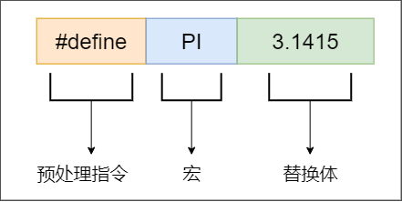
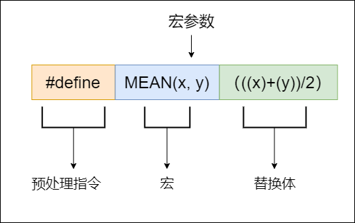

# 预处理指令之define

\#define 指令是再学习C语言时接触的第二个预处理指令，他的基本用法很简单，但是进阶使用却可以实现很多复杂的功能，正是如此，也容易掉入坑里~

## 一、 define的基本用法
define的最简单用法就是宏替换，将一个宏替换为指定的替换体。
```c
#define PI 3.1415
```
这个语句的会将文件中出现的PI（全字匹配,且不在字符串中）替换为3.1415。例如下面的语句：
```c
printf("PI is %f\n",PI);

//输出结果为：PI is 3.1415
```
第一个PI由于在字符串中，所有不会被替换，第二个PI被当成一个常量替换为3.1415。

## define 替换规则
define进行替换时分为两大类：**类对象宏**和**类函数宏**。

在上面使用例子中使用的就是类对象宏。其结构如下：


类对象的由三部分组成：预处理指令#define 、宏名和替换体。

在宏的名称中不能出现空格，必须为连续的整体，除了预处理指令和宏以外都为替换体。

类函数宏的结构如下：



类函数宏可以像函数一样，在宏名后面的括号内添加参数，并且在替换体中将对应的参数替换。例如图中求平均值的宏可以这样使用。
```c
printf("4 和 6 的平均值为: %d\n", MEAN(4, 6));
```

---
## 扩展用法
### 1. #运算符
#运算符将类函数宏的参数字符串化，例如
```c
#include <stdio.h>
#define LOG_INT(X) printf(#X" is :%d\n",x)

int main(void)
{
    int a=10;
    
    LOG_INT(a);
}

```
输出为: ```a is :10```

在调试时可使用#运算符将变量名转换为字符串格式化输出，便于进行调试。

### ##运算符
##运算符将两个记号组合成一个记号
> 其中预处理器记号是宏定义替换体中“单独”的词。  
> 例如：#define FOUR 2*2  
> 该宏定义只有一个记号，即 2*2
> 而 #define SIX 2 * 3
> 在该宏定义中有3个记号,分别为"2", "*", "3"

在下面例子中使用##运算符定义了vara1一个变量,这个变量是由var和a1两个标记合并产生的。
```c
#include <stdio.h>

#define VAR(x)  var##x 
#define LOG_INT(x) printf("var"#x " is :%d\n",var##x)

int main(void)
{
    int VAR(a1) =1;
    int VAR(a2) =10;

    LOG_INT(a1);    
}
```
由于使用##运算符可以间接产生符号，所有运用得当在某些情况可以极大的提高效率。

### 可变参数宏__VA_ARGS__
在上面的例子中我什么使用宏函数打印时，只能一次打印一个变量，如何传递多个变量到printf中呢？  
由于printf的最后一个参数时可变参数，在使用宏传递参数时也需要是可变参数。
使用```...```,```__VA_ARGS__``可以解决这个问题。
解决方法如下
```c
#include <stdio.h>

#define LOG(format,...) printf("::log > " format,...)

int main(void)
{
    for(int i=0; i<3;i++)
    {
        LOG("run cnt :%d",i);
    }
}
```
## 结语
以上就是关于预处理指令#define，相关的用法啦，后续文章将继续系统讲解C语言中一些细节点，欢迎关注！

文中代码可在我的[github]或者gittee中查看，请多多star⭐ 

> [**github 地址**](https://github.com/Gary-Hobson/Blog-Attachment)  
>
> [gitee 地址](https://gitee.com/garyhobson/Blog-Attachment) 

我开通微信公众号啦，更多更及时的信息请关注公众号~  
